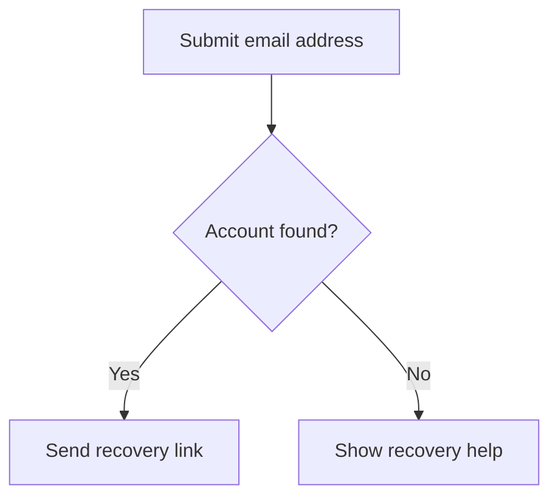
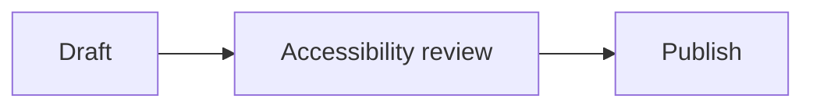
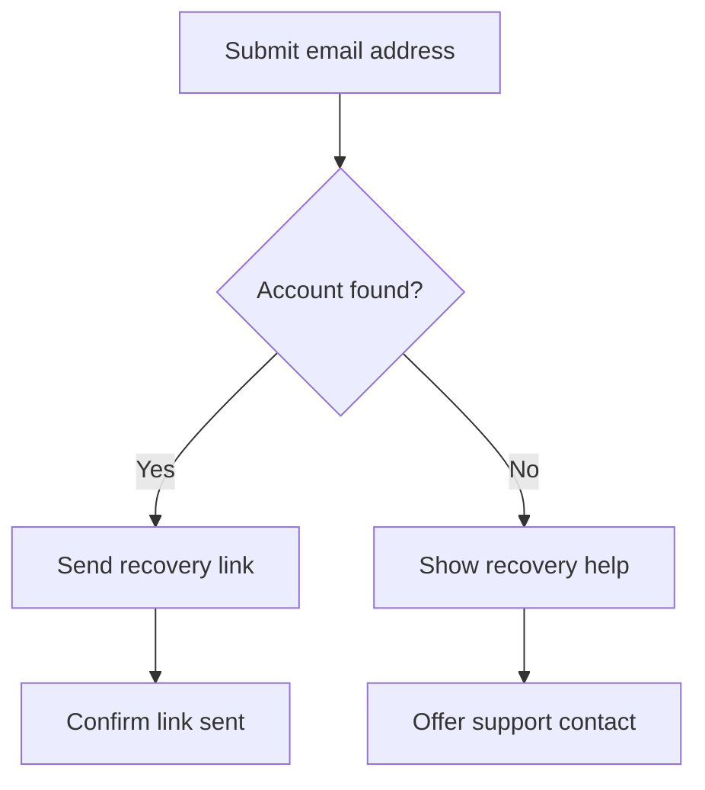
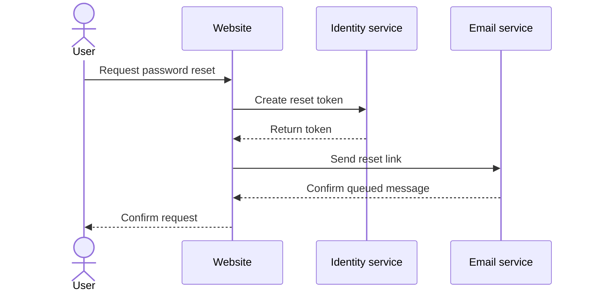

# Mermaid Accessibility Best Practices

## Purpose

Mermaid turns text definitions into diagrams such as flowcharts, sequence
diagrams, state diagrams, class diagrams, timelines, charts, and architecture
views. The source is easier to version and review than manually drawn artwork,
but generated diagrams are not automatically accessible.

Accessible Mermaid content depends on four layers:

1. the diagram source and its accessibility metadata;
2. the exact Mermaid renderer and configuration;
3. the generated SVG or raster output; and
4. the way the publishing platform embeds and exposes that output.

This guide covers accessible titles and descriptions, complex-diagram
alternatives, generated SVG, color and contrast, light and dark presentation,
keyboard interaction, responsive output, security, exports, linting, and
testing. It targets WCAG 2.2 Level AA.

## Core Principles

1. Treat a generated Mermaid diagram as non-text content unless the rendered
   nodes and relationships are proven to have useful semantics.
2. Add `accTitle` and `accDescr` using valid Mermaid syntax.
3. Provide visible structured alternatives for diagrams whose essential
   information does not fit in a concise SVG description.
4. Match the alternative format to the diagram's purpose and relationships.
5. Do not rely on color, shape, position, line style, or visual reading order
   alone.
6. Test the final published output, not only the Mermaid source or an editor
   preview.
7. Preserve secure rendering defaults. Pin Mermaid when the project controls
   the renderer; otherwise record the hosted renderer version and verify the
   capabilities the content requires.
8. Keep source, descriptions, data, and exports synchronized.
9. Avoid making a static diagram keyboard focusable.
10. Include people with relevant disabilities in review of important or
    complex diagrams.

## Decide Whether a Diagram Is Needed

Do not use a diagram when a heading, short list, table, or few sentences would
communicate the information more clearly. Mermaid is useful when relationships,
sequence, branching, hierarchy, timing, or spatial grouping materially improve
understanding.

Before authoring, document:

- the diagram's purpose;
- the question it should answer;
- the essential nodes, participants, states, values, or events;
- the essential relationships and their direction;
- whether the diagram is static or interactive;
- the structured alternative that will preserve its purpose; and
- the renderers and publishing platforms that must support it.

Reducing unnecessary complexity improves the visual diagram and every
alternative presentation.

## Use Valid Mermaid Accessibility Syntax

### `accTitle`

`accTitle` supplies the accessible title. Current Mermaid syntax uses the
keyword followed by a colon and a single-line value:



The title should concisely identify the subject and diagram type when that
context is useful. Mermaid does not define a universal 100-character limit.
Write the shortest title that distinguishes the diagram on the page.

### `accDescr`

Use a colon for a single-line description:



For a multi-line description, omit the colon after `accDescr` and use braces:



Mermaid does not define a universal 500-character maximum. Keep the SVG
description concise enough to be useful as an image description. Move detailed
steps, data, and relationships into visible, structured HTML.

### Do not comment out the metadata

Mermaid comments begin with `%%`. These lines are comments, not accessibility
metadata:

```text
%%accTitle This is ignored as a comment
%%accDescr This is also ignored as a comment
```

Use `accTitle:` and `accDescr:` exactly as documented. Parse and render the
source with the project's exact Mermaid version to catch syntax support and
diagram-type differences.

### Do not invent directives

Lines such as these are not standard Mermaid accessibility syntax:

```text
%%a11y-node A type=question
%%a11y-edge A->B ariaLabel="Yes, continue"
```

They are comments unless a separate project-specific preprocessor implements
them. Do not document them as Mermaid features. If a project introduces custom
annotations, define their schema, transformation, validation, and fallback
behavior separately.

## Write Useful Titles and Descriptions

### Accessible title

A good `accTitle`:

- identifies the subject;
- distinguishes the diagram from others on the page;
- includes the type only when it helps; and
- avoids filenames, internal IDs, or generic labels such as "Diagram."

Examples:

- "Account recovery decision flow"
- "Payment service request sequence"
- "Order states and permitted transitions"
- "Quarterly release timeline"

### Accessible description

A useful `accDescr` states:

- the diagram's purpose;
- the starting context or orientation;
- the main elements or participants;
- the essential sequence, hierarchy, values, or relationships;
- important decisions, exceptions, or outcomes; and
- where a complete visible alternative is available when needed.

Do not merely list colors and shapes. "A blue rectangle points to a green
diamond" describes appearance without explaining meaning.

Do not copy every node label into one long sentence. A flattened description
becomes difficult to navigate and does not preserve structure.

### Visible title and description

Important diagrams should also have visible context. A page heading or figure
caption helps everyone understand why the diagram is present.

```html
<figure aria-labelledby="recovery-flow-heading">
  <h2 id="recovery-flow-heading">Account recovery flow</h2>

  <pre class="mermaid">
flowchart TD
    accTitle: Account recovery decision flow
    accDescr: A recovery request either sends a link or offers additional help. Complete steps follow the diagram.
    A[Submit email address] --&gt; B{Account found?}
    B --&gt;|Yes| C[Send recovery link]
    B --&gt;|No| D[Show recovery help]
  </pre>

  <figcaption>
    <a href="#recovery-flow-description">Read the account recovery steps</a>.
  </figcaption>
</figure>
```

The HTML example escapes `>` because the Mermaid source is embedded in HTML.
Markdown Mermaid fences do not need that escaping.

## Provide Structured Alternatives

`accDescr` creates an SVG description, not a navigable document structure.
Complex diagrams need visible HTML that supports headings, lists, tables,
links, definitions, and task completion.

| Mermaid diagram type | Useful structured alternative |
|---|---|
| Flowchart or decision tree | Ordered steps plus nested lists or a decision table showing conditions and outcomes |
| Sequence diagram | Participant list and a table of messages in chronological order |
| State diagram | State definitions and a transition table with trigger, source, destination, and outcome |
| Class diagram | Class definitions, properties, methods, inheritance, and relationship table |
| Entity relationship diagram | Entity definitions, keys, attributes, cardinality, and relationship table |
| Gantt chart or timeline | Task or event table with dates, duration, owner, status, milestones, and dependencies |
| Pie, XY, quadrant, radar, or Sankey chart | Summary of findings and the underlying data table with units and categories |
| Mind map or tree | Properly nested heading or list hierarchy |
| Architecture, C4, or block diagram | Component inventory, responsibilities, boundaries, interfaces, and relationship table |
| Git graph | Chronological branch, merge, and release history |
| User journey | Ordered stages, user goals, actions, emotions, barriers, and opportunities |

### Flowchart alternative

```html
<section id="recovery-flow-description"
         aria-labelledby="recovery-flow-description-heading">
  <h3 id="recovery-flow-description-heading">Account recovery steps</h3>
  <ol>
    <li>The user submits an email address.</li>
    <li>
      The system checks for an account:
      <ul>
        <li>If an account exists, send a recovery link and confirm it was sent.</li>
        <li>If no account exists, show recovery help and offer support.</li>
      </ul>
    </li>
  </ol>
</section>
```

### Sequence diagram alternative



```html
<table>
  <caption>Password reset request messages</caption>
  <thead>
    <tr>
      <th scope="col">Step</th>
      <th scope="col">From</th>
      <th scope="col">To</th>
      <th scope="col">Message</th>
    </tr>
  </thead>
  <tbody>
    <tr><td>1</td><td>User</td><td>Website</td><td>Request password reset</td></tr>
    <tr><td>2</td><td>Website</td><td>Identity service</td><td>Create reset token</td></tr>
    <tr><td>3</td><td>Identity service</td><td>Website</td><td>Return token</td></tr>
    <tr><td>4</td><td>Website</td><td>Email service</td><td>Send reset link</td></tr>
    <tr><td>5</td><td>Email service</td><td>Website</td><td>Confirm queued message</td></tr>
    <tr><td>6</td><td>Website</td><td>User</td><td>Confirm request</td></tr>
  </tbody>
</table>
```

### Keep alternatives synchronized

Whenever possible, generate the diagram and its alternative from the same
reviewed data model. If they are maintained separately:

- require both in the same change;
- compare nodes, participants, values, edges, and conditions;
- identify the diagram version or update date; and
- assign an owner for content review.

Do not expose raw Mermaid source as the only alternative. Source syntax may be
helpful to developers, but it is not automatically an equivalent explanation
for all users.

## Understand Mermaid's Generated SVG

Current Mermaid documentation states that the renderer automatically adds an
`aria-roledescription` based on the diagram type. When `accTitle` and
`accDescr` are provided, it also generates:

- `<title>` and `<desc>` elements;
- `aria-labelledby` referencing the title; and
- `aria-describedby` referencing the description.

A simplified current output resembles:

```html
<svg aria-labelledby="generated-title-id"
     aria-describedby="generated-description-id"
     aria-roledescription="flowchart-v2"
     id="generated-diagram-id">
  <title id="generated-title-id">Account recovery decision flow</title>
  <desc id="generated-description-id">
    A recovery request either sends a link or offers additional help.
  </desc>
  <!-- Generated diagram content -->
</svg>
```

The exact IDs, classes, diagram-type value, internal elements, and attributes
can change by Mermaid version and integration. Do not copy generated IDs into
source or depend on undocumented internal class names.

### Do not replace Mermaid's label relationships blindly

The renderer currently uses `aria-labelledby` for the title and
`aria-describedby` for the description. Do not rewrite both as one
`aria-labelledby` value without a tested reason. A label identifies the image;
a description provides additional information.

Some publishing systems add `role="img"` to treat the SVG as one atomic image.
Others expose the root SVG through its native SVG accessibility mapping. If a
post-processing step adds a role, verify the computed name, description, and
screen reader behavior. Do not present one hand-authored SVG pattern as a
guarantee across every Mermaid renderer and host.

### Node-by-node semantics are not automatic

`accTitle` and `accDescr` describe the diagram as a whole. They do not make
every generated node, edge, arrow, participant, or value a useful accessible
object.

Do not automatically add `role="list"` and `role="listitem"` to generated SVG
groups. A visual layout is not necessarily a list, DOM order may not match the
meaningful reading order, and list semantics do not express branching,
cardinality, timing, containment, or graph relationships.

If users need to inspect or operate individual items, provide an accessible
HTML view or build and test a purpose-specific interactive component. Generated
SVG internals are a fragile foundation for a complex widget.

### Generated IDs

IDs need to be unique in the final HTML document. They do not need to be unique
across unrelated pages or separate external SVG documents.

- Let Mermaid manage its generated IDs.
- Check the final page for duplicates when several inline diagrams are present.
- Do not generate accessibility IDs from timestamps and random strings merely
  to appear collision-resistant.
- Use Mermaid's `deterministicIds` configuration when stable generated output
  or snapshot testing requires it.
- If using `deterministicIDSeed`, design the render pipeline so separate inline
  diagrams cannot receive colliding IDs.
- Preserve every referenced ID during sanitization, optimization, and export.

### `xmlns`

The SVG namespace declaration is important when SVG is serialized or served as
a standalone XML document. It is not an accessibility attribute and is not a
universal linting requirement for inline SVG parsed in an HTML document.

## Embedding and Export Modes

Accessibility behavior changes with the embedding method.

| Output or embedding mode | Responsibility |
|---|---|
| Inline SVG generated in the page | Preserve generated title, description, ARIA references, language, styles, and unique IDs |
| External SVG through `` | Give the HTML image an appropriate `alt`; do not assume the external SVG's internal title and description are exposed |
| Raster PNG or JPEG | Give the HTML image `alt` and provide any long structured alternative in HTML |
| `<object>` or iframe | Give the embedding element a useful accessible name, test entry and exit behavior, and provide an external HTML alternative |
| CSS background image | Use only for decoration or provide the complete information in ordinary HTML |
| PDF or office-document export | Add appropriate document tags, alternative text, reading order, and visible alternative; SVG metadata is not a substitute for document accessibility |
| Markdown platform renderer | Test the platform's exact Mermaid version, sanitizer, theme, and output accessibility |

### External SVG example

```html
<figure>
  
  <figcaption>
    <a href="#recovery-flow-description">Read the complete account recovery steps</a>.
  </figcaption>
</figure>
```

Do not leave the HTML `alt` empty solely because the source SVG contains a
`<title>` and `<desc>`.

### Standalone downloads

If users can download an SVG:

- retain its title and description;
- include the correct namespace and view box;
- preserve text as text when practical;
- identify language where the format and reader support it;
- test the file independently of the source page; and
- provide the structured HTML or data alternative near the download.

## Choose Clear Diagram Content

### Nodes and participants

- Use human-readable labels rather than internal IDs.
- Expand uncommon abbreviations in the page or alternative.
- Keep labels concise without removing necessary meaning.
- Give visually similar nodes distinct textual labels.
- Do not use shape alone to distinguish a decision, process, database, or
  external system.
- State participant roles and boundaries in the structured alternative.

### Edges and relationships

- Label branches when the outcome is not otherwise clear.
- Use labels such as "Approved" and "Needs revision" when they are clearer than
  generic "Yes" and "No."
- Preserve direction and source-to-destination meaning in the alternative.
- Explain unlabeled relationships when their meaning depends on line style,
  arrow type, or position.
- Do not use connector color alone to encode status or relationship type.

### Reading order and layout

Choose a direction that matches the content and document language. Reduce line
crossings and avoid layouts that imply relationships through proximity alone.

Visual placement is not a programmatic reading order. State the intended
sequence or hierarchy in the description and structured alternative.

## Color and Contrast

### Apply WCAG 2.2 ratios

- Normal text generally needs at least 4.5 to 1 contrast.
- Text meeting WCAG's large-scale definition generally needs at least 3 to 1.
- Do not treat 18 CSS pixels alone as the large-text threshold.
- Visual information required to understand meaningful nodes, boundaries,
  connectors, data marks, and states generally needs at least 3 to 1 against
  adjacent colors under WCAG 1.4.11.
- Not every decorative fill needs 3 to 1 against every neighboring fill when
  labels, outlines, or other cues preserve the information.

Use the WCAG 2.x contrast method for WCAG 2.2 conformance. APCA and WCAG 3 work
can be monitored for research, but they do not replace WCAG 2.2 contrast tests.

### Do not rely on color alone

Combine color with:

- direct labels;
- line styles;
- patterns;
- icons with text alternatives;
- border treatments;
- shape plus textual identification; or
- values in the structured alternative.

This applies to status, ownership, participant groups, critical paths, data
series, positive or negative outcomes, and selected states.

### Test actual themes

Mermaid themes and derived colors can change. The current theming documentation
states that custom theme variables use hex colors and that the `base` theme is
the modifiable base theme.

- Centralize theme configuration instead of styling individual generated
  elements by unstable internal selectors.
- Test text, fills, borders, connector lines, arrowheads, notes, labels, focus,
  and data marks.
- Test every site-supported light and dark presentation.
- Test diagrams inside the actual background and container colors.
- Test forced-colors mode and keep the structured alternative usable when SVG
  styling is lost.
- Recheck themes after Mermaid updates.

Do not assume that selecting Mermaid's `dark` theme or adding a
`prefers-color-scheme` rule automatically produces accessible dark mode.

## Responsive Layout, Zoom, and Reflow

SVG can scale without pixelation, but scaling a dense diagram can make its text
too small to read.

- Include a useful `viewBox` in exported SVG.
- Do not clip the diagram when text is resized or browser zoom reaches 200
  percent and 400 percent.
- Let users open a larger view or download an SVG when that improves access.
- Keep the visible title, summary, alternative, and controls reflowable.
- Avoid fixed pixel dimensions that overflow small viewports without a usable
  scroll or enlargement path.
- Test long labels and translations.
- Do not disable browser zoom.

WCAG 1.4.10 allows an exception for parts of content that require a
two-dimensional layout for meaning or use. A complex diagram can require
two-dimensional scrolling. The surrounding title, description, controls, and
structured alternative still need to reflow.

## Keyboard and Interactive Diagrams

### Static diagrams

A static diagram does not need `tabindex="0"`. Keyboard focus should move to
links, buttons, and other controls, not to every decorative SVG group.

If a diagram is visually scrollable, ensure keyboard users can reach and scroll
its container without becoming trapped, and also provide a structured
alternative that does not depend on two-dimensional scrolling.

### Links and click actions

Avoid putting the only path to essential links or actions inside a diagram.
Provide visible HTML links or controls nearby.

If Mermaid links or click actions are enabled:

- each link is keyboard reachable;
- its purpose is understandable from its accessible name and context;
- focus is visible and not obscured;
- pointer and keyboard actions produce the same result;
- the accessible name includes the visible label for speech input;
- target size and hover or focus content meet applicable criteria; and
- every action has an equivalent HTML path.

Do not simulate a button with a non-focusable generated SVG group.

### Interactive exploration

When users must select nodes, expand branches, filter data, or inspect details,
build an accessible interaction model outside the generated static SVG or use a
tested component designed for that task.

Define:

- native roles and controls;
- keyboard behavior;
- focus order and restoration;
- names, states, and values;
- status announcements;
- touch and pointer alternatives; and
- a non-visual representation of the same state.

Mermaid source plus ARIA attributes does not by itself define an accessible
graph-navigation widget.

## Motion and Animation

Avoid decorative animation in diagrams. If animation, automatic updates, or
moving paths are added by a host or plugin:

- provide pause, stop, or hide controls when WCAG 2.2.2 applies;
- respect `prefers-reduced-motion`;
- avoid flashes that exceed WCAG thresholds;
- do not use motion as the only indicator of change; and
- keep the final state available in text.

Do not make accessibility claims based on Mermaid animation behavior without
testing the exact version and integration.

## Secure and Stable Rendering

Accessibility and security can fail together when untrusted diagram source is
allowed to inject markup or interaction.

- Keep Mermaid's `securityLevel: 'strict'` default unless a reviewed use case
  requires another mode.
- Do not lower security merely to add essential links; provide them in HTML.
- Treat user-supplied Mermaid source as untrusted input.
- Use supported sanitization and a restrictive content security policy.
- Pin Mermaid and renderer dependencies through the project's package lock
  when the project controls them.
- For platform-managed rendering, record the observed version, observation
  date, discovery method, and tested capabilities.
- Do not load production dependencies from an unpinned `@latest` URL.
- Review release notes and security advisories before upgrades.
- Limit source size and diagram complexity to prevent rendering failures.
- Render errors as accessible text without exposing sensitive details.

The current Mermaid configuration schema also protects selected secure
configuration keys from diagram-level overrides. Keep security decisions in
site-owned configuration.

### Controlled and platform-managed renderers

The project may not control the Mermaid version that ultimately displays a
diagram. Document the control model instead of calling every renderer pinned.

| Rendering model | Version evidence | Project responsibility |
|---|---|---|
| Self-managed renderer | Package manifest, lockfile, container digest, or other versioned build configuration | Pin the dependency, review updates, test generated output, and retain a supported rollback path. |
| Platform-managed renderer | Version probe, platform documentation, or a dated observation from the target service | Record what was observed, test required syntax and output, maintain an equivalent alternative, and recheck after platform changes. |
| Pre-rendered static export | Version recorded by the export job or publishing workflow | Preserve the export with its source and alternative, then test the final embedding context. |

GitHub.com Markdown, GitHub Enterprise Server, GitHub Pages, local previews,
and exported files are separate rendering surfaces:

- GitHub.com controls the Mermaid version used for Mermaid code blocks in its
  Markdown interface.
- GitHub Enterprise Server may use a different version depending on the
  installed release.
- GitHub Pages is a site build and hosting service. It does not automatically
  inherit the Mermaid renderer used by GitHub.com Markdown. The Jekyll theme,
  plugin, client script, or build pipeline determines whether and how Mermaid
  is rendered.
- A local editor preview can use yet another version and configuration.
- An SVG, raster, PDF, or office-document export has its own transformation and
  embedding requirements.

Do not infer support on one surface from successful rendering on another.

### Discover and record a hosted version

GitHub documents the Mermaid `info` diagram as the way to check the version
currently used by GitHub.com. This guide includes a live `info` probe in
[Mermaid Version Information](#mermaid-version-information).

The output is a live diagnostic, not a pinned dependency. It may change without
a commit to the repository. It also reports only the renderer on the surface
where the diagram is displayed.

Record platform-managed rendering with enough detail to reproduce the check:

| Field | Example |
|---|---|
| Surface | GitHub.com Markdown, GitHub Pages production, or GitHub Enterprise Server |
| Control | Project-managed or platform-managed |
| Version | Configured version or value displayed by `info` |
| Discovery method | Lockfile, build log, `info` diagram, or platform release documentation |
| Date observed | ISO date such as `2026-07-18` |
| Required capabilities | Diagram types, accessibility declarations, theme behavior, security mode, and export format |
| Fallback | Visible structured alternative, data table, list, or pre-rendered accessible asset |
| Owner | Person or team responsible for rechecking |

Because the `info` result is itself rendered as a diagram, do not make it the
only accessible record. Add a plain-text observation to the project's renderer
record, for example:

```text
Last manually observed on GitHub.com: Mermaid x.y.z on YYYY-MM-DD.
```

Label this as an observation rather than a guarantee. Recheck it when diagrams
fail, when a platform or enterprise release changes, and before relying on a
new Mermaid feature.

### Verify capabilities, not only the version number

A version string alone does not establish that the host exposes the expected
output. For every supported publishing surface, verify:

- the required diagram types parse and render;
- `accTitle` and `accDescr` produce the expected title, description, and ARIA
  relationships;
- the host's sanitizer preserves required semantics and references;
- security restrictions remain appropriate;
- light, dark, increased-contrast, and forced-colours presentations remain
  understandable;
- several diagrams on one page do not produce conflicting IDs;
- the visible structured alternative remains available if rendering fails; and
- published exports preserve the information needed in their destination
  format.

When the host version is unknown, unavailable, or changing, rely only on
features verified on that host and keep essential information outside the
generated diagram.

## Authoring and Review Workflow

### Before authoring

- Decide whether a diagram materially improves understanding.
- Identify purpose, audience, essential relationships, and alternative format.
- Select a Mermaid diagram type that matches the information.
- Confirm the target renderer supports that diagram type and accessibility
  syntax.

### During authoring

- Add valid `accTitle:` and `accDescr:` lines.
- Use clear node, participant, edge, state, and data labels.
- Keep visual complexity proportionate to the task.
- Avoid color-only and shape-only meaning.
- Write the structured alternative alongside the source.
- Keep essential links and controls in HTML.

### Before publication

- When the project controls the renderer, parse and render with the pinned
  production version.
- When the platform controls the renderer, record its observed version and
  verify required capabilities on the target surface.
- Inspect the generated SVG and the final accessibility tree.
- Validate the structured alternative against the diagram.
- Test all supported themes, zoom levels, viewports, and exports.
- Test the actual Markdown, documentation, or application host.
- Record the reviewer, render version, date, and known limitations.

### AI-generated diagrams

Treat AI output as a draft.

- Verify every node, edge, value, date, state, and relationship against the
  source material.
- Rewrite generic or inaccurate accessibility descriptions.
- Check that the structured alternative matches the final diagram.
- Reject invented Mermaid directives and unsupported configuration.
- Do not infer security, accessibility, or conformance from successful visual
  rendering.

## Linting and Automated Validation

### Source checks

For meaningful diagrams, automation can check:

- the exact Mermaid source parses with the configured or currently observed
  target renderer;
- `accTitle:` is present and not commented out;
- `accDescr:` or `accDescr { ... }` is present and not commented out;
- title and description values are non-empty;
- prohibited custom directives are not mistaken for Mermaid features;
- external links and click actions follow project policy; and
- a complex diagram references a visible structured alternative.

Do not enforce arbitrary universal character counts. A lint rule can warn about
unusually long content for human review, but length alone does not determine
quality.

### Rendered-output checks

For inline SVG, automation can check:

- generated `<title>` and `<desc>` elements exist when supplied in source;
- `aria-labelledby` resolves to the generated title;
- `aria-describedby` resolves to the generated description;
- IDs are unique in the final page;
- sanitization or optimization did not remove referenced elements;
- the diagram has no unintended focusable descendants;
- interactive elements have names, roles, states, keyboard behavior, and
  visible focus; and
- render errors are exposed as text.

For external `` output, check the HTML image's `alt`, not only the internal
SVG metadata.

### Contrast checks

Automated contrast testing needs the actual rendered pairs:

- text against its effective background;
- essential node and group boundaries against adjacent colors;
- essential connector lines and arrowheads against their backgrounds;
- focus indicators and interactive states; and
- every supported light and dark theme.

"Monochrome" is not a reason to skip contrast testing. Black-and-white or
single-hue diagrams still have measurable text, line, and boundary contrast.

Automation cannot determine whether the description is equivalent, the reading
order is meaningful, the alternative preserves relationships, or the diagram
is understandable. Manual and user review are required.

## Testing

### Content and equivalent-purpose testing

1. State the question the diagram should answer.
2. Identify every essential relationship, branch, value, state, event, or
   dependency.
3. Answer the question using the visual diagram.
4. Answer it using only the title, description, and structured alternative.
5. Compare the available information, sequence, relationships, and conclusions.
6. Correct both representations together.

Do not judge equivalence only by counting node labels.

### Keyboard testing

- Confirm static SVG is not an unnecessary Tab stop.
- Operate every diagram link, control, popup, and enlargement action.
- Verify visible focus and logical focus order.
- Enter and leave scrollable or embedded diagrams without a trap.
- Confirm every diagram action has an equivalent HTML path.
- Test character shortcuts if an integration adds them.

### Screen reader testing

Test supported browser, operating system, renderer, host, and
assistive-technology combinations. Record versions and settings.

- Navigate to the diagram in context.
- Confirm the computed accessible name and description.
- Check whether the diagram is exposed as an image, graphic, document, or
  another role by the final host.
- Read the visible structured alternative by headings, lists, and tables.
- Confirm duplicate or excessively long announcements are avoided.
- Test every interactive element and status message.

Do not publish a fixed table promising identical announcements across named
screen readers. Results depend on the host, browser, SVG mode, and current
assistive-technology version.

### Visual and low-vision testing

- Test normal and large default text.
- Test 200 percent and 400 percent browser zoom.
- Test narrow viewports and both orientations.
- Test every supported light and dark presentation.
- Test forced-colors mode.
- Confirm labels, nodes, lines, arrowheads, legends, and focus remain visible.
- Confirm long translations do not overlap or disappear.
- Verify a usable enlargement or download path for dense diagrams.

### Export and platform testing

- Test the original Markdown or source preview.
- Test the production page after sanitization and optimization.
- Record whether each tested renderer is pinned or platform-managed.
- For a hosted renderer, record the discovery method, observed version, and
  date.
- Test inline SVG, external SVG, and raster variants that are published.
- Test print and PDF output when offered.
- Test with JavaScript unavailable or rendering failed.
- Test several diagrams on one page for duplicate IDs.
- Retest after Mermaid, plugin, theme, sanitizer, or host updates.

## Common Failures

| Failure | Correction |
|---|---|
| Writing `%%accTitle` or `%%accDescr` | Use the valid `accTitle:` and `accDescr:` keywords without the Mermaid comment prefix |
| Requiring arbitrary 100-character and 500-character limits | Write concise useful metadata and use visible structure for detail |
| Treating successful rendering as proof of accessibility | Inspect the final SVG, accessibility tree, host, and alternative |
| Depending only on `<desc>` for a complex diagram | Provide visible headings, lists, tables, or prose that preserve structure |
| Exposing raw Mermaid source as the only alternative | Provide a plain-language, task-appropriate representation |
| Adding list semantics to every generated SVG group | Treat the diagram as a whole or build a tested purpose-specific interface |
| Replacing `aria-describedby` with `aria-labelledby` for the description | Preserve distinct label and description relationships unless testing supports a change |
| Generating title IDs from timestamps and random strings | Let Mermaid manage IDs and use deterministic rendering where stability is required |
| Requiring globally unique IDs across unrelated pages | Require uniqueness in each final document and preserve referenced IDs |
| Treating `xmlns` as an accessibility attribute for all inline SVG | Require it for serialized standalone SVG contexts, not as universal accessibility metadata |
| Inventing `%%a11y-node` and `%%a11y-edge` syntax | Use supported Mermaid syntax or document a real preprocessing extension separately |
| Using 18 CSS pixels as the large-text threshold | Apply WCAG's large-scale text definition accurately |
| Using APCA as a WCAG 2.2 pass or fail test | Use WCAG 2.x ratios for WCAG 2.2 conformance |
| Claiming monochrome diagrams cannot be contrast tested | Test every meaningful text, line, boundary, and background pair |
| Assuming a dark Mermaid theme passes dark-mode requirements | Test actual colors in every supported presentation |
| Making static diagrams keyboard focusable | Keep static graphics out of the Tab order and focus real controls only |
| Putting essential links only inside a diagram | Provide equivalent visible HTML links |
| Loading Mermaid from an unpinned `@latest` dependency | Pin and review the production renderer version |
| Describing a platform-managed renderer as pinned | Record the observed version, date, discovery method, and tested capabilities |
| Assuming GitHub Pages uses GitHub.com's Mermaid version | Identify the renderer supplied by the Pages theme, plugin, script, or build pipeline |
| Treating a live `info` diagram as a permanent version record | Keep a dated plain-text observation and recheck the target platform |
| Testing on GitHub.com and assuming GitHub Enterprise Server behaves identically | Test the installed enterprise release as a separate rendering surface |
| Using `securityLevel: 'loose'` without need | Keep strict security defaults and place essential interaction in HTML |
| Trusting an editor preview instead of the published page | Test the production renderer, sanitizer, theme, embed mode, and exports |

## Definition of Done

- [ ] The diagram's purpose, audience, and essential relationships are
  documented.
- [ ] Mermaid is the clearest appropriate presentation for the content.
- [ ] The source uses valid `accTitle:` syntax without a comment prefix.
- [ ] The source uses valid single-line or multi-line `accDescr` syntax.
- [ ] The title and description are concise, accurate, and reviewed.
- [ ] Complex content has a visible structured alternative matched to its
  diagram type.
- [ ] The diagram and alternative are synchronized.
- [ ] Nodes, participants, edges, states, values, and dates use meaningful
  labels.
- [ ] Color, shape, position, and line style are not the only cues.
- [ ] Text, essential graphical objects, controls, and focus meet applicable
  contrast requirements.
- [ ] Light, dark, and forced-colors presentations have been tested.
- [ ] Browser zoom, text enlargement, narrow viewports, and two-dimensional
  scrolling have been tested.
- [ ] Static diagrams do not add unnecessary keyboard stops.
- [ ] Interactive links and controls have complete HTML alternatives.
- [ ] A controlled production renderer is pinned, or a platform-managed
  renderer has a dated version observation and capability record.
- [ ] GitHub.com, GitHub Enterprise Server, GitHub Pages, local preview, and
  export surfaces used by the project have been treated separately.
- [ ] The generated SVG contains and references the expected title and
  description.
- [ ] IDs are unique in the final page and remain intact after optimization.
- [ ] External images have appropriate HTML `alt` values.
- [ ] SVG, raster, print, PDF, and embedded outputs are accessible as published.
- [ ] Secure rendering defaults remain in place or exceptions are documented
  and reviewed.
- [ ] Render failures provide accessible text and the alternative remains
  available.
- [ ] Keyboard, screen reader, low-vision, contrast, platform, and
  equivalent-purpose testing has been completed.
- [ ] Automated checks supplement, but do not replace, manual and user review.

## Related WCAG Criteria

### Content and visual presentation

- [1.1.1 Non-text Content (Level A)](https://www.w3.org/WAI/WCAG22/Understanding/non-text-content.html)
- [1.3.1 Info and Relationships (Level A)](https://www.w3.org/WAI/WCAG22/Understanding/info-and-relationships.html)
- [1.3.2 Meaningful Sequence (Level A)](https://www.w3.org/WAI/WCAG22/Understanding/meaningful-sequence.html)
- [1.3.3 Sensory Characteristics (Level A)](https://www.w3.org/WAI/WCAG22/Understanding/sensory-characteristics.html)
- [1.3.4 Orientation (Level AA)](https://www.w3.org/WAI/WCAG22/Understanding/orientation.html)
- [1.4.1 Use of Color (Level A)](https://www.w3.org/WAI/WCAG22/Understanding/use-of-color.html)
- [1.4.3 Contrast (Minimum) (Level AA)](https://www.w3.org/WAI/WCAG22/Understanding/contrast-minimum.html)
- [1.4.4 Resize Text (Level AA)](https://www.w3.org/WAI/WCAG22/Understanding/resize-text.html)
- [1.4.10 Reflow (Level AA)](https://www.w3.org/WAI/WCAG22/Understanding/reflow.html)
- [1.4.11 Non-text Contrast (Level AA)](https://www.w3.org/WAI/WCAG22/Understanding/non-text-contrast.html)
- [1.4.12 Text Spacing (Level AA)](https://www.w3.org/WAI/WCAG22/Understanding/text-spacing.html)
- [1.4.13 Content on Hover or Focus (Level AA)](https://www.w3.org/WAI/WCAG22/Understanding/content-on-hover-or-focus.html)

### Keyboard, motion, and interaction

- [2.1.1 Keyboard (Level A)](https://www.w3.org/WAI/WCAG22/Understanding/keyboard.html)
- [2.1.2 No Keyboard Trap (Level A)](https://www.w3.org/WAI/WCAG22/Understanding/no-keyboard-trap.html)
- [2.1.4 Character Key Shortcuts (Level A)](https://www.w3.org/WAI/WCAG22/Understanding/character-key-shortcuts.html)
- [2.2.2 Pause, Stop, Hide (Level A)](https://www.w3.org/WAI/WCAG22/Understanding/pause-stop-hide.html)
- [2.3.1 Three Flashes or Below Threshold (Level A)](https://www.w3.org/WAI/WCAG22/Understanding/three-flashes-or-below-threshold.html)
- [2.4.3 Focus Order (Level A)](https://www.w3.org/WAI/WCAG22/Understanding/focus-order.html)
- [2.4.4 Link Purpose (In Context) (Level A)](https://www.w3.org/WAI/WCAG22/Understanding/link-purpose-in-context.html)
- [2.4.7 Focus Visible (Level AA)](https://www.w3.org/WAI/WCAG22/Understanding/focus-visible.html)
- [2.4.11 Focus Not Obscured (Minimum) (Level AA)](https://www.w3.org/WAI/WCAG22/Understanding/focus-not-obscured-minimum.html)
- [2.5.3 Label in Name (Level A)](https://www.w3.org/WAI/WCAG22/Understanding/label-in-name.html)
- [2.5.8 Target Size (Minimum) (Level AA)](https://www.w3.org/WAI/WCAG22/Understanding/target-size-minimum.html)
- [4.1.2 Name, Role, Value (Level A)](https://www.w3.org/WAI/WCAG22/Understanding/name-role-value.html)
- [4.1.3 Status Messages (Level AA)](https://www.w3.org/WAI/WCAG22/Understanding/status-messages.html)

## Related Guides

- [Charts and Graphs Accessibility Best Practices](./CHARTS_GRAPHS_ACCESSIBILITY_BEST_PRACTICES.md)
- [Color Contrast Accessibility Best Practices](./COLOR_CONTRAST_ACCESSIBILITY_BEST_PRACTICES.md)
- [Image Alt Text Accessibility Best Practices](./IMAGE_ALT_TEXT_ACCESSIBILITY_BEST_PRACTICES.md)
- [Keyboard Accessibility Best Practices](./KEYBOARD_ACCESSIBILITY_BEST_PRACTICES.md)
- [Light and Dark Mode Accessibility Best Practices](./LIGHT_DARK_MODE_ACCESSIBILITY_BEST_PRACTICES.md)
- [SVG Accessibility Best Practices](./SVG_ACCESSIBILITY_BEST_PRACTICES.md)
- [Tables Accessibility Best Practices](./TABLES_ACCESSIBILITY_BEST_PRACTICES.md)
- [User Personalization Accessibility Best Practices](./USER_PERSONALIZATION_ACCESSIBILITY_BEST_PRACTICES.md)
- [Mermaid Diagram Types](./MERMAID_DIAGRAM_TYPES.md)
- [Mermaid Transformation Best Practices](./MERMAID_TRANSFORMATION_BEST_PRACTICES.md)
- [CI/CD Accessibility Best Practices](./CI_CD_ACCESSIBILITY_BEST_PRACTICES.md)

Use the project's
[Accessibility Bug Reporting Best Practices](./ACCESSIBILITY_BUG_REPORTING_BEST_PRACTICES.md)
to assign severity and priority. This guide does not define a universal
severity scale.

## References

- [Mermaid: Accessibility Options](https://mermaid.ai/open-source/config/accessibility.html)
- [Mermaid: Configuration](https://mermaid.ai/open-source/config/configuration.html)
- [Mermaid: Theme Configuration](https://mermaid.ai/open-source/config/theming.html)
- [Mermaid: Configuration Schema](https://mermaid.ai/open-source/schemas/config.schema.json)
- [Mermaid: Security](https://mermaid.ai/open-source/community/security.html)
- [GitHub: Creating diagrams and checking the Mermaid version](https://docs.github.com/en/get-started/writing-on-github/working-with-advanced-formatting/creating-diagrams#checking-your-version-of-mermaid)
- [GitHub: About GitHub Pages and Jekyll](https://docs.github.com/en/pages/setting-up-a-github-pages-site-with-jekyll/about-github-pages-and-jekyll)
- [W3C WAI: Complex Images](https://www.w3.org/WAI/tutorials/images/complex/)
- [WAI-ARIA 1.2: `aria-roledescription`](https://www.w3.org/TR/wai-aria-1.2/#aria-roledescription)
- [SVG Accessibility API Mappings 1.0](https://www.w3.org/TR/svg-aam-1.0/)

### Machine-Readable Standards

For AI systems and automated tooling, see
[wai-yaml-ld](https://github.com/mgifford/wai-yaml-ld) for structured
accessibility standards:

- [WCAG 2.2 (YAML)](https://github.com/mgifford/wai-yaml-ld/blob/main/kitty-specs/001-wai-standards-yaml-ld-ingestion/research/wcag-2.2-normative.yaml)
- [WAI-ARIA Informative (YAML)](https://github.com/mgifford/wai-yaml-ld/blob/main/kitty-specs/001-wai-standards-yaml-ld-ingestion/research/wai-aria-informative.yaml)
- [HTML Living Standard Accessibility (YAML)](https://github.com/mgifford/wai-yaml-ld/blob/main/kitty-specs/001-wai-standards-yaml-ld-ingestion/research/html-living-standard-accessibility.yaml)
- [Standards Link Graph (YAML)](https://github.com/mgifford/wai-yaml-ld/blob/main/kitty-specs/001-wai-standards-yaml-ld-ingestion/research/standards-link-graph.yaml)

## Mermaid Version Information

This guide uses Mermaid 11.16.0 as its reference version. The reference version
identifies the documentation and behavior reviewed while maintaining this
guide. It does not claim that every publishing platform uses Mermaid 11.16.0.

The diagram below reports the Mermaid version supplied by the current Markdown
hosting platform. It may differ from the version used by GitHub Pages, local
builds, GitHub Enterprise Server, exported diagrams, or other rendering
services.

```mermaid
info
```

The `info` result is diagnostic and dynamic. Record its visible value and the
observation date in plain text when version evidence is required.

---

This document is available under the repository's [MIT License](../LICENSE).
