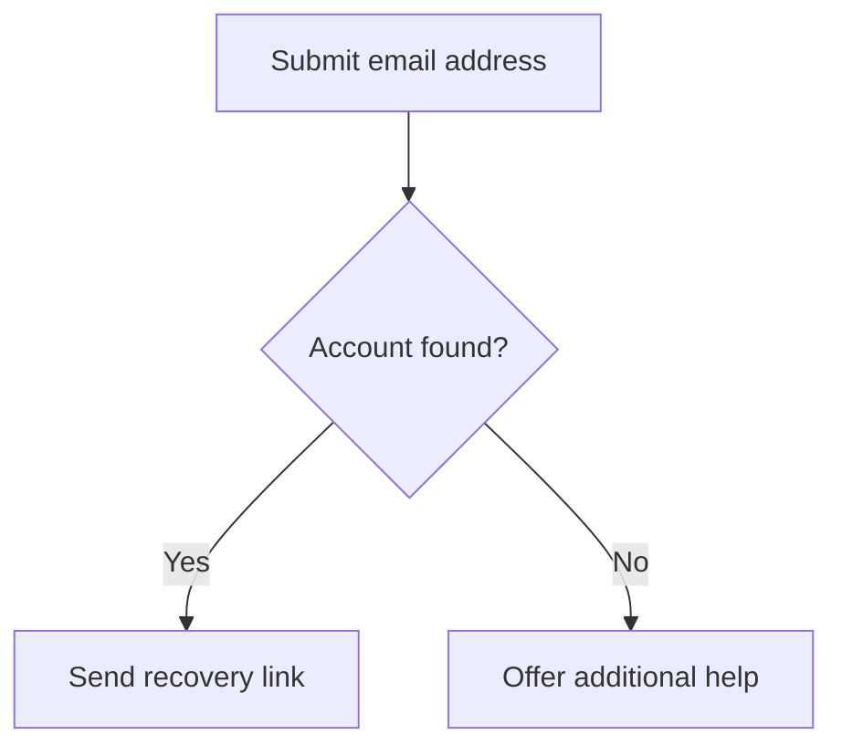
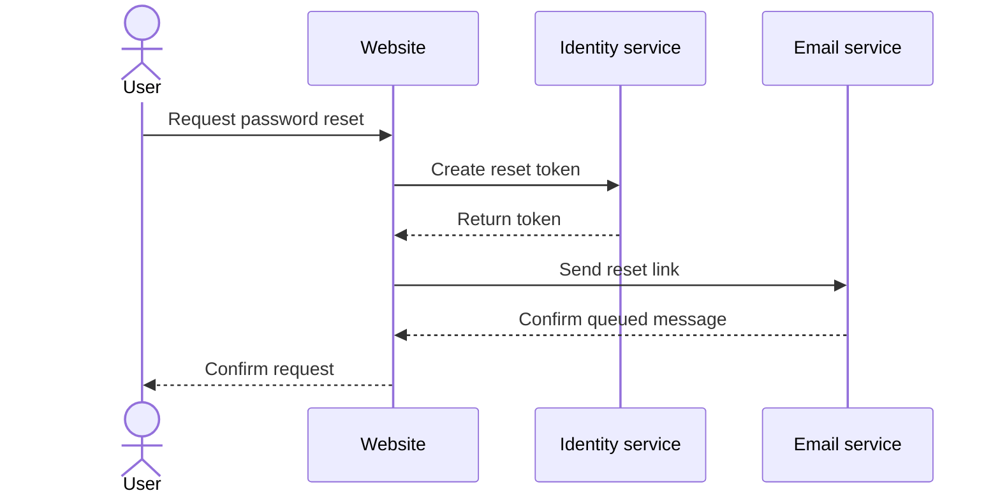
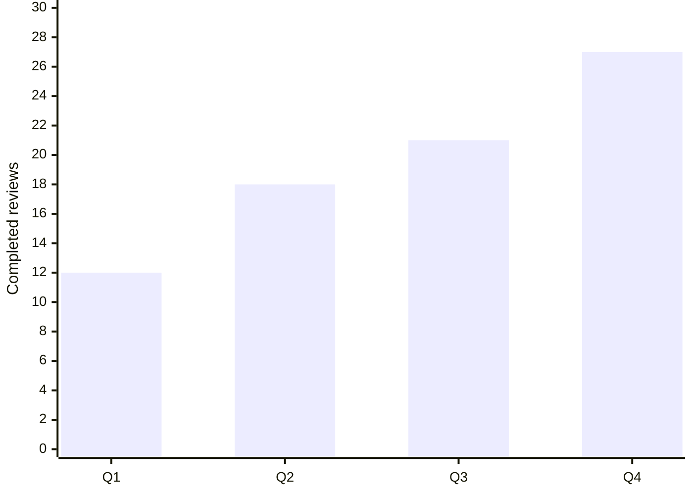

# Mermaid Diagram Types

## Purpose

This reference helps authors choose a Mermaid diagram type, use the correct
declaration, and provide an accessible alternative that preserves the
diagram's meaning.

It is based on Mermaid 11.16.0. Mermaid adds diagram types and sometimes
changes beta declarations. Pin the renderer version used by a site, verify
every source file with that version, and review the official documentation
before upgrading.

This page is not a record of which narrative generators a particular project
has implemented. Keep implementation status in tested, machine-readable
project data rather than in a general Mermaid reference.

## First Decide Whether a Diagram Is Needed

Use a diagram when relationships, sequence, branching, hierarchy, timing, or
spatial grouping materially improve understanding. Prefer ordinary HTML when
a short paragraph, list, or table communicates the same information more
clearly.

Before choosing a diagram type, identify:

1. the question the diagram must answer;
2. the essential entities, events, values, or states;
3. the essential relationships and their direction;
4. whether position, area, time, or sequence carries meaning;
5. the structured alternative that will preserve that meaning; and
6. the Mermaid versions and publishing platforms that must render it.

Do not choose a type merely because its visual style is appealing. Choose the
smallest structure that accurately represents the information.

## Current Version and Type Status

The Mermaid 11.16.0 source contains 31 user-facing syntax guides when the
Railroad guide is counted as one type with four grammar declarations. The
documentation sidebar currently links 30 of them and has not yet added the
Railroad guide.

Do not publish an unqualified claim that Mermaid supports a fixed number of
diagram types. The number depends on the Mermaid version, whether external
plugins are counted, and whether related declarations are counted separately.

Mermaid 11.16.0 also has several kinds of status:

- **Canonical**: the declaration without `-beta` is accepted by the 11.16.0
  detector.
- **Beta required**: only the declaration ending in `-beta` is accepted.
- **Compatibility alias**: both the canonical declaration and the older
  `-beta` form are accepted.
- **External plugin**: the type is documented with Mermaid but must be
  registered separately.
- **Experimental documentation**: the syntax page explicitly warns that the
  type or syntax may change, even if the declaration does not end in
  `-beta`.

Status is not uniform across the documentation. For example, the 11.16.0 beta
policy accepts canonical `sankey`, `ishikawa`, and `treemap` declarations,
while their syntax pages retain experimental or new-type warnings. Treat an
explicit page warning as a reason to pin the version and test carefully.

## Quick Selection Guide

| If the main question is... | Start with... | Usually provide... |
|---|---|---|
| What happens next, and where does it branch? | Flowchart | Ordered steps or a decision table |
| Who owns each process step? | Swimlane | Steps with owner and handoff columns |
| Who sends what to whom, and in what order? | Sequence or ZenUML | Chronological message table |
| What states exist and what triggers transitions? | State | State definitions and transition table |
| How are software types or data entities related? | Class or entity relationship | Definitions, attributes, keys, and relationship table |
| When do tasks or events occur? | Gantt or timeline | Date, duration, owner, status, and dependency table |
| How does a person experience a process? | User journey | Stage, action, goal, barrier, and outcome table |
| How are components or services connected? | Architecture, C4, block, or flowchart | Component inventory and relationship table |
| How does work move through columns? | Kanban | Task table grouped by status |
| How is a hierarchy organized? | Mindmap, tree view, or treemap | Nested headings or lists; include values for a treemap |
| How do quantities compare or change? | XY chart, pie, radar, quadrant, Sankey, or treemap | Summary plus the underlying data table |
| How are sets related? | Venn | Set membership and intersection table |
| What causes contribute to an outcome? | Ishikawa | Hierarchical cause list |
| How do branches, commits, and merges relate? | Git graph | Chronological branch and merge history |
| How are requirements traced? | Requirement | Requirement and verification matrix |
| How is a network packet divided? | Packet | Field table with bit ranges and meanings |
| How does a strategy map value and evolution? | Wardley | Component coordinates, dependencies, and evolution table |
| Which Cynefin domain contains each item? | Cynefin | Domain definitions, item list, and transition table |
| How does information change in an event-modeled system? | Event modeling | Timeline of triggers, commands, events, and views |
| What grammar paths are valid? | Railroad | The source grammar and a rule-by-rule explanation |

If several types fit, use the one that requires the least visual convention
knowledge from the intended audience.

## Diagram Type Reference for Mermaid 11.16.0

The declaration is the first non-frontmatter, non-comment content in a Mermaid
definition. Declaration spelling and capitalization matter.

### Process, Interaction, and Time

| Type | Declaration | 11.16.0 note | Best for | Structured alternative |
|---|---|---|---|---|
| [Flowchart](https://mermaid.js.org/syntax/flowchart.html) | `flowchart` or `graph` plus direction | Canonical | Steps, decisions, dependencies, and networks | Ordered steps, nested lists, or decision table |
| [Swimlane](https://mermaid.js.org/syntax/swimlanes.html) | `swimlane-beta` plus optional direction | Beta required; added in 11.16.0 | Processes divided by actor, team, system, or phase | Step, owner, input, output, and handoff table |
| [Sequence](https://mermaid.js.org/syntax/sequenceDiagram.html) | `sequenceDiagram` | Canonical | Time-ordered messages among participants | Numbered message table with from, to, action, and response |
| [State](https://mermaid.js.org/syntax/stateDiagram.html) | `stateDiagram-v2` or `stateDiagram` | Canonical | States, events, guards, and transitions | State definitions and source, trigger, destination, outcome table |
| [User journey](https://mermaid.js.org/syntax/userJourney.html) | `journey` | Canonical | User stages, activities, actors, and satisfaction scores | Ordered stage, actor, action, score, barrier, and opportunity table |
| [Gantt](https://mermaid.js.org/syntax/gantt.html) | `gantt` | Canonical | Tasks, dates, durations, milestones, and dependencies | Task schedule with dates, duration, owner, status, and dependencies |
| [Timeline](https://mermaid.js.org/syntax/timeline.html) | `timeline` | Canonical | Chronological events and periods | Chronological event list or table with exact dates |
| [Kanban](https://mermaid.js.org/syntax/kanban.html) | `kanban` | Canonical | Work items grouped by workflow stage | Task table grouped by stage, with owner, priority, and status |
| [Event modeling](https://mermaid.js.org/syntax/eventmodeling.html) | `eventmodeling` | Canonical; added in 11.15.0 | Information flow through triggers, commands, events, and views | Time-frame table preserving lanes, entities, data, and relationships |

### Structure, Software, and Systems

| Type | Declaration | 11.16.0 note | Best for | Structured alternative |
|---|---|---|---|---|
| [Class](https://mermaid.js.org/syntax/classDiagram.html) | `classDiagram` | Canonical | Classes, members, inheritance, composition, and association | Class definitions plus member and relationship tables |
| [Entity relationship](https://mermaid.js.org/syntax/entityRelationshipDiagram.html) | `erDiagram` | Canonical | Entities, attributes, keys, cardinality, and relationships | Entity definitions plus keys, attributes, and relationship table |
| [Architecture](https://mermaid.js.org/syntax/architecture.html) | `architecture`; `architecture-beta` remains accepted | Compatibility alias | Services, groups, junctions, boundaries, and connections | Component inventory with responsibility, group, interface, and dependency |
| [C4](https://mermaid.js.org/syntax/c4.html) | `C4Context`, `C4Container`, `C4Component`, `C4Dynamic`, or `C4Deployment` | Documentation explicitly calls C4 experimental | C4 system, container, component, dynamic, and deployment views | Elements, boundaries, responsibilities, technologies, and relationships |
| [Block](https://mermaid.js.org/syntax/block.html) | `block`; `block-beta` remains accepted | Compatibility alias | Author-positioned blocks and connectors | Block inventory and directed relationship table |
| [Mindmap](https://mermaid.js.org/syntax/mindmap.html) | `mindmap` | Canonical | Concept hierarchies and branches | Properly nested headings or lists |
| [TreeView](https://mermaid.js.org/syntax/treeView.html) | `treeView-beta` | Beta required | Directory-like hierarchical structures | Nested list or tree with annotations |
| [ZenUML](https://mermaid.js.org/syntax/zenuml.html) | `zenuml` after plugin registration | External `@mermaid-js/mermaid-zenuml` plugin; lazy loading and async rendering are experimental | Nested calls and control flow in sequence diagrams | Chronological message table with nesting and branch conditions |

### Data and Analytical Views

| Type | Declaration | 11.16.0 note | Best for | Structured alternative |
|---|---|---|---|---|
| [Pie](https://mermaid.js.org/syntax/pie.html) | `pie` | Canonical | A small part-to-whole comparison | Data table with category, value, unit, and calculated percentage |
| [XY chart](https://mermaid.js.org/syntax/xyChart.html) | `xychart`; `xychart-beta` remains accepted | Compatibility alias | Bar and line series on categorical or numeric axes | Data table with series, x value, y value, and units |
| [Quadrant chart](https://mermaid.js.org/syntax/quadrantChart.html) | `quadrantChart` | Canonical | Items positioned on two meaningful axes | Item table with exact x and y values and quadrant |
| [Radar](https://mermaid.js.org/syntax/radar.html) | `radar-beta` | Beta required | Comparing a few entities across the same dimensions | Matrix of entities, dimensions, values, scale, and units |
| [Sankey](https://mermaid.js.org/syntax/sankey.html) | `sankey`; `sankey-beta` remains accepted | Compatibility alias; syntax page still says experimental | Quantified flows from sources through transformations to targets | Source, target, value, and unit table plus a findings summary |
| [Treemap](https://mermaid.js.org/syntax/treemap.html) | `treemap`; `treemap-beta` remains accepted | Compatibility alias; syntax page warns that this is a new type | Hierarchical part-to-whole comparison by area | Nested hierarchy and value table with units |
| [Venn](https://mermaid.js.org/syntax/venn.html) | `venn-beta` | Beta required | Membership and intersections among a small number of sets | Set membership and intersection table |

### Domain-Specific Views

| Type | Declaration | 11.16.0 note | Best for | Structured alternative |
|---|---|---|---|---|
| [Git graph](https://mermaid.js.org/syntax/gitgraph.html) | `gitGraph` | Canonical | Branches, commits, checkouts, cherry-picks, and merges | Chronological branch and commit history |
| [Requirement](https://mermaid.js.org/syntax/requirementDiagram.html) | `requirementDiagram` | Canonical | Requirements, elements, risk, verification, and trace relationships | Requirement traceability and verification matrix |
| [Packet](https://mermaid.js.org/syntax/packet.html) | `packet`; `packet-beta` remains accepted | Compatibility alias | Bit fields in a network packet or binary structure | Field, start bit, end bit, length, value, and description table |
| [Ishikawa](https://mermaid.js.org/syntax/ishikawa.html) | `ishikawa`; `ishikawa-beta` remains accepted | Compatibility alias; syntax page warns that this is a new type | Hierarchical causes contributing to a problem or outcome | Nested cause list grouped by category |
| [Wardley](https://mermaid.js.org/syntax/wardley.html) | `wardley-beta` | Beta required | Components positioned by visibility and evolution | Component, visibility, evolution, dependency, inertia, and note table |
| [Cynefin](https://mermaid.js.org/syntax/cynefin.html) | `cynefin-beta` | Beta required; added in 11.16.0 | Items classified into complexity domains and transitions between domains | Domain definitions plus item and transition tables |
| [Railroad](https://mermaid.js.org/syntax/railroad.html) | `railroad-ebnf-beta`, `railroad-abnf-beta`, `railroad-peg-beta`, or `railroad-beta` | Beta required; added in 11.16.0 | EBNF, ABNF, PEG, or Mermaid railroad IR grammar paths | Source grammar and a rule-by-rule description of sequence, choice, and repetition |

## Choose Data Charts Carefully

Mermaid can render several chart types, but convenience does not make every
chart a good choice.

- Use a pie chart only for a small part-to-whole comparison. A sorted bar chart
  is often easier to compare.
- Do not use a radar chart when precise comparison is important. A grouped bar
  chart or data table is usually easier to read.
- Use a quadrant chart only when both axes and the coordinates have defined
  meaning. Do not turn subjective labels into false precision.
- Use a Sankey diagram only when flow quantity is essential. State the units
  and provide the source, target, and value data.
- A treemap's area is difficult to compare precisely. Provide the values and
  hierarchy outside the graphic.
- Limit Venn diagrams to a small number of sets. Complex set relationships are
  usually clearer in a membership matrix.

Do not rely on color to distinguish a series, category, status, set, or path.
Use direct labels, patterns where supported, line styles, markers, position,
and a data table. Verify text contrast and the contrast of meaningful graphical
objects in every supported theme.

## Add Mermaid Accessibility Metadata

Mermaid documents `accTitle` and `accDescr` for all diagram and chart types.
Use the keywords without comment markers:



Mermaid comments begin with `%%`. These lines are ignored as comments and do
not provide accessibility metadata:

```text
%%accTitle This is ignored
%%accDescr This is also ignored
```

Use a colon after `accTitle` and after a single-line `accDescr`. For a
multi-line description, omit the colon and enclose the description in braces.

`accTitle` and `accDescr` improve the generated SVG's accessible name and
description. They do not turn nodes, edges, bars, slices, or regions into a
navigable semantic structure. Complex diagrams still need visible structured
alternatives.

## Match the Alternative to the Type

### Sequence example



The structured alternative should preserve the message order:

```html
<table>
  <caption>Password reset messages</caption>
  <thead>
    <tr>
      <th scope="col">Step</th>
      <th scope="col">From</th>
      <th scope="col">To</th>
      <th scope="col">Message</th>
    </tr>
  </thead>
  <tbody>
    <tr><td>1</td><td>User</td><td>Website</td><td>Request password reset</td></tr>
    <tr><td>2</td><td>Website</td><td>Identity service</td><td>Create reset token</td></tr>
    <tr><td>3</td><td>Identity service</td><td>Website</td><td>Return token</td></tr>
    <tr><td>4</td><td>Website</td><td>Email service</td><td>Send reset link</td></tr>
    <tr><td>5</td><td>Email service</td><td>Website</td><td>Confirm queued message</td></tr>
    <tr><td>6</td><td>Website</td><td>User</td><td>Confirm request</td></tr>
  </tbody>
</table>
```

### XY chart example



```html
<table>
  <caption>Completed accessibility reviews by quarter</caption>
  <thead>
    <tr>
      <th scope="col">Quarter</th>
      <th scope="col">Completed reviews</th>
    </tr>
  </thead>
  <tbody>
    <tr><th scope="row">Q1</th><td>12</td></tr>
    <tr><th scope="row">Q2</th><td>18</td></tr>
    <tr><th scope="row">Q3</th><td>21</td></tr>
    <tr><th scope="row">Q4</th><td>27</td></tr>
  </tbody>
</table>
```

### Tree example


Also expose the hierarchy as a nested list or a native file tree component.
Do not assume indentation in the Mermaid source will be available to readers of
the rendered SVG.

## Narrative Generation and Automation

A project may generate a prose or HTML alternative from Mermaid source, but
that is a project feature, not a built-in guarantee of each diagram type.

### Use a semantic model

Prefer this pipeline:

1. validate the exact Mermaid source with the pinned renderer;
2. parse the type with version-matched tooling;
3. transform the source into a type-specific semantic model;
4. generate both the visual diagram and its structured alternative from that
   model;
5. escape untrusted text before inserting it into HTML; and
6. compare the source, diagram, and alternative in automated tests.

Do not use a few regular expressions as a general Mermaid parser. Mermaid
supports nesting, quoted text, comments, frontmatter, multiple declarations,
and type-specific grammar. A line-based expression that works for a simple
example can silently omit branches, cardinality, parallel sequences, composite
states, or data values.

Mermaid's internal parser and diagram database APIs are not a stable semantic
interchange contract. If a project depends on internal APIs, pin the Mermaid
version and run regression tests before every upgrade.

### Define support honestly

For each supported type, document and test:

- accepted declarations and aliases;
- source features the generator understands;
- source features it rejects or cannot preserve;
- the semantic elements and relationships in the output;
- malformed-input behavior;
- HTML escaping and URL sanitization;
- synchronization between visual and alternative output; and
- tests using nested, empty, malformed, and adversarial input.

If the generator cannot preserve the diagram's essential meaning, require an
author-written structured alternative. Do not produce confident but incomplete
prose.

Store generator coverage in a tested JSON, YAML, or code manifest. Generate any
human-readable support table from that source so the documentation cannot
drift from the implementation.

## Rendering and Publishing Requirements

The same Mermaid source can produce different results across a live browser
renderer, a static site plug-in, Mermaid CLI, an editor preview, a raster
export, and a PDF conversion.

For every supported publishing path:

1. record the Mermaid version and configuration;
2. parse every diagram during continuous integration;
3. inspect the final generated SVG or image;
4. verify that title and description relationships survive embedding;
5. verify the visible structured alternative remains adjacent or clearly
   linked;
6. test light, dark, high-contrast, zoom, and narrow viewport presentation;
7. test keyboard access only where the diagram contains real interaction; and
8. test representative output with screen readers.

A static SVG diagram should not receive `tabindex="0"` merely so it can be
focused. If nodes or links are interactive, implement them as real operable
controls or links with visible focus, meaningful names, and documented keyboard
behavior.

Pin versions rather than loading an unconstrained major or latest release.
Keep Mermaid's `securityLevel: 'strict'` default unless a documented and tested
requirement justifies a different setting. Treat user-authored Mermaid source,
labels, links, configuration, and generated HTML as untrusted input.

## Testing Checklist

### Source and version

- [ ] The Mermaid version is pinned.
- [ ] Every declaration is supported by that version.
- [ ] Beta and external plugin dependencies are documented.
- [ ] Every Mermaid block parses in continuous integration.
- [ ] Unsupported syntax fails visibly rather than disappearing silently.

### Meaning and alternatives

- [ ] The chosen type matches the question the diagram must answer.
- [ ] `accTitle` identifies the diagram concisely.
- [ ] `accDescr` summarizes the essential meaning.
- [ ] Complex information has a visible structured alternative.
- [ ] The alternative preserves order, hierarchy, direction, values, units,
      conditions, and relationships as applicable.
- [ ] The visual and alternative are generated or reviewed together.

### Visual presentation

- [ ] Meaning does not depend on color alone.
- [ ] Text and meaningful graphical objects meet applicable contrast
      requirements.
- [ ] Labels remain readable at 200% and 400% zoom.
- [ ] The diagram does not cause page-wide horizontal scrolling at narrow
      widths; a local scroll region or alternate view is provided when needed.
- [ ] Light, dark, and forced-color presentation have been checked.

### Interaction and output

- [ ] Static diagrams are not added to the tab order.
- [ ] Interactive elements use native links or controls when possible.
- [ ] All interaction works with a keyboard and has visible focus.
- [ ] Accessible names and descriptions survive the final embedding method.
- [ ] Raster and PDF exports include an equivalent alternative in the
      surrounding document.
- [ ] Representative output has been tested with assistive technologies.

## Common Failures

- Publishing a fixed count of Mermaid types without naming the Mermaid version.
- Listing a declaration that the deployed renderer does not recognize.
- Treating a sidebar icon as an authoritative stability classification.
- Assuming ZenUML is included in the Mermaid core bundle.
- Calling C4 stable while its own syntax page says it is experimental.
- Using `%%accTitle` or `%%accDescr`, which comments out the metadata.
- Assuming `accDescr` replaces a structured alternative for a complex diagram.
- Flattening a graph into prose that loses direction, branches, cardinality, or
  values.
- Parsing every diagram type with line-based regular expressions.
- Generating raw HTML from unescaped diagram labels.
- Relying on a chart's visual area, color, or position without exposing exact
  data.
- Testing only in the Mermaid Live Editor rather than in the final site.
- Loading an unpinned Mermaid release in production.

## Definition of Done

A Mermaid diagram is ready to publish when:

1. the type is appropriate for the information;
2. its declaration parses with the pinned production renderer;
3. beta or plugin dependencies are intentional and documented;
4. it has a useful `accTitle` and `accDescr`;
5. a visible structured alternative preserves its essential meaning;
6. color, contrast, zoom, reflow, and theme behavior have been checked;
7. any interaction is keyboard operable and exposes useful semantics;
8. the final embedded or exported output has been tested; and
9. the diagram, its data, and its alternative have a synchronization and review
   process.

## Related Guides

- [Mermaid Accessibility Best Practices](MERMAID_ACCESSIBILITY_BEST_PRACTICES.md)
- [Charts and Graphs Accessibility Best Practices](CHARTS_GRAPHS_ACCESSIBILITY_BEST_PRACTICES.md)
- [SVG Accessibility Best Practices](SVG_ACCESSIBILITY_BEST_PRACTICES.md)
- [Tables Accessibility Best Practices](TABLES_ACCESSIBILITY_BEST_PRACTICES.md)
- [Color Contrast Accessibility Best Practices](COLOR_CONTRAST_ACCESSIBILITY_BEST_PRACTICES.md)
- [Keyboard Accessibility Best Practices](KEYBOARD_ACCESSIBILITY_BEST_PRACTICES.md)

## References

### Mermaid

- [Diagram syntax and configuration](https://mermaid.js.org/intro/syntax-reference.html)
- [Accessibility options](https://mermaid.js.org/config/accessibility.html)
- [Mermaid configuration](https://mermaid.js.org/config/configuration.html)
- [Mermaid releases](https://github.com/mermaid-js/mermaid/releases)
- [Mermaid 11.16.0 release](https://github.com/mermaid-js/mermaid/releases/tag/mermaid%4011.16.0)
- [ZenUML plugin](https://github.com/mermaid-js/mermaid/tree/develop/packages/mermaid-zenuml)

### Accessibility Standards

- [WCAG 2.2: Text Alternatives](https://www.w3.org/WAI/WCAG22/Understanding/text-alternatives.html)
- [WCAG 2.2: Use of Color](https://www.w3.org/WAI/WCAG22/Understanding/use-of-color.html)
- [WCAG 2.2: Contrast (Minimum)](https://www.w3.org/WAI/WCAG22/Understanding/contrast-minimum.html)
- [WCAG 2.2: Non-text Contrast](https://www.w3.org/WAI/WCAG22/Understanding/non-text-contrast.html)
- [WCAG 2.2: Reflow](https://www.w3.org/WAI/WCAG22/Understanding/reflow.html)
- [WAI Images Tutorial: Complex Images](https://www.w3.org/WAI/tutorials/images/complex/)
- [WAI Tables Tutorial](https://www.w3.org/WAI/tutorials/tables/)

---

**Last reviewed**: July 18, 2026

**Reference renderer**: Mermaid 11.16.0

**License**: MIT
