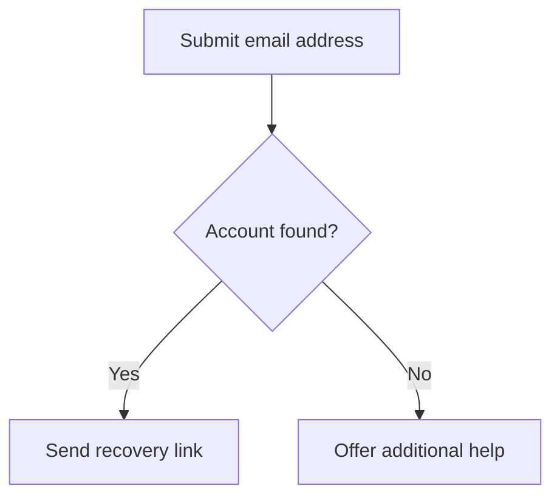

# Mermaid Transformation Best Practices

## Purpose

This guide covers the safe transformation of Mermaid source into published
diagrams and accessible alternatives. It addresses browser rendering, static
SVG export, inline embedding, external images, theming, post-processing,
optimization, validation, and testing.

It is based on Mermaid 11.16.0 and targets WCAG 2.2 Level AA. Pin the Mermaid
version used by a project and test every transformation before upgrading.

This is implementation guidance, not a normative specification. W3C standards,
the HTML Living Standard, and the Mermaid documentation remain authoritative.

## Core Principles

1. Preserve meaning, not merely SVG elements.
2. Put accessible metadata in Mermaid source whenever the renderer supports it.
3. Generate the visual diagram and its structured alternative from the same
   reviewed information.
4. Preserve Mermaid's generated `<title>`, `<desc>`, roles, IDs, and ARIA
   references unless a verified compatibility fix is required.
5. Do not infer a semantic graph from SVG position or appearance.
6. Do not enable unsafe rendering options to obtain richer labels or links.
7. Select the embedding method before deciding which metadata to generate.
8. Treat inline SVG IDs as document-wide IDs, not file-local IDs.
9. Validate the final HTML, SVG, CSS, and accessible alternative.
10. Fail visibly when a transformation cannot preserve security or meaning.

## Understand the Transformation Layers

An accessible Mermaid result depends on five separate layers:

| Layer | Responsibility | Do not assume |
|---|---|---|
| Semantic source or model | Nodes, relationships, values, order, labels, title, description, and structured alternative | The SVG can reconstruct every source relationship |
| Mermaid source | Valid diagram declaration, `accTitle`, `accDescr`, and type-specific syntax | Comments or invented directives become metadata |
| Renderer | Parse the pinned syntax, sanitize according to configuration, and generate SVG | Every Mermaid version produces the same DOM |
| SVG transformation | Preserve required structure, references, styling, and security | Adding ARIA roles makes a visual graph semantically navigable |
| Host document | Choose the embedding method, expose the visible alternative, manage themes, and provide interaction | Internal SVG metadata is exposed identically through every embedding method |

When a defect appears, identify the responsible layer before applying a patch.
Do not compensate for a missing structured alternative by adding unsupported
roles to generated shapes.

## Choose a Transformation Strategy

| Situation | Preferred strategy |
|---|---|
| The Mermaid source is under project control | Add valid `accTitle` and `accDescr`, then render without rewriting metadata |
| A complex diagram needs an alternative | Generate or author structured HTML from the semantic source, not from SVG geometry |
| A browser displays Mermaid at runtime | Render with the pinned Mermaid API, validate the returned SVG, and insert it into a controlled host |
| A static site builds diagrams ahead of time | Render deterministic SVG or raster assets, validate them, and publish adjacent HTML alternatives |
| An SVG will be used in an `` | Supply the `` in the host; retain internal SVG metadata for standalone reuse |
| A legacy renderer omits root metadata | Patch only the missing root metadata from trusted, structured inputs |
| A design requires light and dark variants | Render and test controlled variants or re-render when the site's selected mode changes |
| An optimizer changes generated SVG | Use an SVG-aware allowlist and verify DOM, references, accessible metadata, and pixels afterward |

Post-processing is appropriate for a specific, tested compatibility gap. It is
not a substitute for correct source, a structured alternative, or a secure
renderer configuration.

## Recommended Pipeline

```mermaid
flowchart LR
    accTitle: Accessible Mermaid publication pipeline
    accDescr: Reviewed source is parsed and rendered with a pinned Mermaid version, validated as SVG and CSS, embedded according to its delivery mode, and tested with its structured alternative.
    A[Reviewed semantic source] --> B[Mermaid source and HTML alternative]
    B --> C[Parse and render with pinned Mermaid]
    C --> D[Validate SVG, IDs, ARIA, and CSS]
    D --> E[Embed for the selected delivery mode]
    E --> F[Browser and assistive technology tests]
```



The same pipeline in text:

1. Review the diagram's purpose, essential relationships, and data.
2. Create valid Mermaid source with `accTitle` and `accDescr`.
3. Create a visible structured alternative suited to the diagram type.
4. Parse and render with an exact Mermaid version and controlled configuration.
5. Parse the returned SVG as XML and validate its invariants.
6. Apply only documented, narrowly scoped transformations.
7. Validate any embedded and host CSS.
8. embed or export using rules for the selected delivery mode.
9. Test the final page or document, including the structured alternative.

## Author Metadata in Mermaid Source

Mermaid supports accessible titles and descriptions across diagram types.
Current syntax uses `accTitle:` and `accDescr:` without comment markers.



Do not parse these commented lines as metadata:

```text
%%accTitle This is a Mermaid comment
%%accDescr This is also a Mermaid comment
```

Do not use a regular expression such as this:

```javascript
source.match(/%%\s*accTitle\s*(.+)/);
```

It searches for comments, cannot correctly handle frontmatter or multi-line
descriptions, and creates a second parser that will drift from Mermaid.

When valid metadata is present, Mermaid 11.16.0 generates root `<title>` and
`<desc>` elements with IDs, `aria-labelledby`, `aria-describedby`, a role, and
`aria-roledescription`. Inspect and preserve that output.

## Use a Secure Renderer Configuration

Initialize Mermaid once for a rendering context. Keep the default strict
security level unless a documented, threat-modeled requirement justifies a
different mode.

```javascript
import mermaid from 'mermaid';

mermaid.initialize({
  startOnLoad: false,
  securityLevel: 'strict',
  htmlLabels: false,
  suppressErrorRendering: true
});
```

Important configuration points:

- `securityLevel: 'strict'` encodes HTML in labels and disables click
  functionality. Mermaid identifies it as the default.
- `securityLevel: 'loose'` permits HTML and click functionality. Do not select
  it merely to support labels, data URLs, or scripts.
- `securityLevel: 'sandbox'` renders in a sandboxed iframe but can limit links
  and other interaction. Test the actual embedding model before relying on it.
- `htmlLabels` is now a root-level setting. Diagram-specific settings such as
  `flowchart.htmlLabels` are deprecated.
- `htmlLabels: false` improves SVG portability by avoiding HTML labels inside
  `<foreignObject>`. If a project enables HTML labels, test sanitization,
  browser support, SVG export, PDF conversion, and the content security policy.
- `suppressErrorRendering: true` lets an application handle a parse error
  without inserting Mermaid's error graphic. The application must still show a
  useful visible error during authoring and preserve the structured alternative
  at runtime.
- Site-controlled limits such as `maxTextSize` and `maxEdges` help bound
  untrusted or accidental input. Keep security-sensitive configuration in the
  site initialization rather than author-controlled frontmatter.

Pin an exact Mermaid version in the package lockfile and in any CDN URL. Do not
load an unconstrained latest or major version in production.

## Render, Parse, and Validate Without Rewriting

Prefer Mermaid's API to a separate source parser. Parse before rendering and
validate the returned SVG as a DOM, not as a serialized string.

```javascript
export async function renderStaticMermaid({ source, renderId, host }) {
  await mermaid.parse(source, { suppressErrors: false });

  const { svg } = await mermaid.render(renderId, source);
  const svgRoot = parseAndValidateMermaidSvg(svg);
  const importedSvg = document.importNode(svgRoot, true);

  host.replaceChildren(importedSvg);
}
```

Use a unique, valid `renderId` for every inline diagram on a page. A static
build can derive it from a page-scoped slug. A client application can use a
project ID allocator. Do not call `Date.now()` plus `Math.random()` and assume
that collisions, hydration differences, or reproducible builds are solved.

### SVG validation function

```javascript
const SVG_NAMESPACE = 'http://www.w3.org/2000/svg';

export function parseAndValidateMermaidSvg(svgText) {
  const xml = new DOMParser().parseFromString(svgText, 'image/svg+xml');
  const parserError = xml.querySelector('parsererror');

  if (parserError) {
    throw new Error('Mermaid returned SVG that is not well-formed XML.');
  }

  const root = xml.documentElement;
  if (root.localName !== 'svg' || root.namespaceURI !== SVG_NAMESPACE) {
    throw new Error('Expected an SVG root element.');
  }

  const elements = [root, ...root.querySelectorAll('*')];
  const ids = new Map();

  for (const element of elements) {
    if (!element.id) continue;
    if (ids.has(element.id)) {
      throw new Error(`Duplicate SVG ID: ${element.id}`);
    }
    ids.set(element.id, element);
  }

  for (const element of elements) {
    for (const attribute of ['aria-labelledby', 'aria-describedby']) {
      const tokens = element.getAttribute(attribute)?.trim().split(/\s+/) ?? [];
      for (const token of tokens) {
        if (token && !ids.has(token)) {
          throw new Error(`${attribute} references missing ID: ${token}`);
        }
      }
    }
  }

  const rootChildren = [...root.children];
  const title = rootChildren.find(element => element.localName === 'title');
  const description = rootChildren.find(element => element.localName === 'desc');

  if (!title?.textContent?.trim()) {
    throw new Error('The generated SVG has no root accessible title.');
  }
  if (!description?.textContent?.trim()) {
    throw new Error('The generated SVG has no root accessible description.');
  }
  if (!root.hasAttribute('viewBox')) {
    throw new Error('The generated SVG has no viewBox for responsive scaling.');
  }
  if (root.querySelector('script')) {
    throw new Error('Scripts are not allowed in static diagram SVG.');
  }

  for (const element of elements) {
    for (const attribute of element.getAttributeNames()) {
      if (attribute.toLowerCase().startsWith('on')) {
        throw new Error(`Event handler is not allowed: ${attribute}`);
      }
    }
  }

  return root;
}
```

This validates a project policy for static diagrams. Adjust the policy only
when the project intentionally supports trusted interaction and has tests for
it. A syntactically valid SVG can still be inaccessible, insecure in its host,
or semantically incomplete.

### Preserve the renderer's root semantics

Do not automatically replace Mermaid's root role with `role="img"`. Mermaid
11.16.0 currently generates `role="graphics-document document"` for a rendered
flowchart with accessibility metadata. Other versions or diagram types may
differ.

Changing the role can change how assistive technologies expose descendants.
Define a project policy based on the pinned renderer, embedding method, and
tested browser and assistive-technology combinations. Record an intentional
compatibility patch with the tests that justify it.

## Do Not Invent Node Semantics from SVG Geometry

A generated flowchart often contains `<g>`, `<path>`, `<rect>`, `<text>`, and
marker elements. Those elements reflect layout and drawing, not necessarily a
stable semantic graph.

Do not apply this transformation to every visual node:

```html
<g role="listitem">
  <title>Node label</title>
</g>
```

Problems include:

- `listitem` requires a meaningful owning list context;
- layout order may not match logical or reading order;
- a node label does not communicate incoming and outgoing relationships;
- decisions, edge labels, cardinality, parallel paths, and nested groups can be
  lost;
- Mermaid may change generated classes and group structure between releases;
- making every group navigable can create a long and confusing interaction
  model.

Do not hide connectors or arrow markers merely because they are drawn with
paths. Direction and relationships can be essential information.

For complex diagrams, expose structure in adjacent HTML such as an ordered
list, transition table, message table, entity relationship table, or data
table. Generate that structure from the semantic source or reviewed author
data, not from pixel positions or element order in the SVG.

## Apply Embedding-Specific Rules

Internal SVG metadata does not behave as the host text alternative in every
delivery mode.

| Delivery mode | Accessible-name strategy | Structured alternative | Key transformation rule |
|---|---|---|---|
| Inline `<svg>` in HTML | Preserve the SVG title, description, role, and ARIA references | Place visible HTML adjacent to or clearly linked from the figure | Ensure all inline IDs are unique across the whole HTML document |
| `` | Provide a useful `alt` attribute on the `` | Put the detailed description in surrounding HTML | Do not rely on the external file's internal `<title>` and `<desc>` as the `` alternative |
| `<object data="diagram.svg">` | Label and test the object in the supported browser and assistive-technology matrix | Put a visible alternative outside the object | Fallback content is not a dependable alternative while the object successfully loads |
| Standalone SVG | Preserve root title, description, role, language, and references | Provide a companion HTML description for complex diagrams | Keep the SVG namespace because the file is parsed as XML |
| CSS background image | Treat as decorative | Put all information in HTML | Do not use a CSS background for a meaningful diagram |
| PNG or other raster export | Provide host `alt` text | Put the detailed description and data in the host document | SVG metadata does not survive rasterization |
| PDF or office document | Use the target format's image alternative and document structure | Include a nearby description or data table | Verify the exported tag structure rather than assuming conversion preserved SVG semantics |

### Inline SVG example

```html
<figure aria-labelledby="publishing-heading">
  <h2 id="publishing-heading">Publishing workflow</h2>
  <div id="publishing-diagram"></div>
  <figcaption>
    The workflow has three stages. A draft moves to accessibility review, then
    publication. If the review finds a blocker, the draft returns for revision.
  </figcaption>
</figure>
```

Insert the validated SVG into `publishing-diagram`. Keep the visible
description useful without requiring a screen reader.

### External image example

```html
<figure>
  
  <figcaption>
    <a href="#publishing-workflow-steps">Read the complete workflow steps</a>
  </figcaption>
</figure>
```

The `alt` identifies and summarizes the diagram. The linked HTML preserves its
full structure.

## Patch Missing Metadata Only as a Compatibility Measure

When an old or third-party renderer cannot generate root metadata, accept the
title and description as separate trusted inputs. Do not scrape commented
Mermaid source with regular expressions.

```javascript
const SVG_NAMESPACE = 'http://www.w3.org/2000/svg';

export function addMissingRootMetadata(root, {
  titleText,
  descriptionText,
  idPrefix
}) {
  if (!/^[A-Za-z][A-Za-z0-9_.-]*$/.test(idPrefix)) {
    throw new Error('idPrefix must be a safe, page-unique identifier.');
  }

  const directChildren = [...root.children];
  let title = directChildren.find(element => element.localName === 'title');
  let description = directChildren.find(element => element.localName === 'desc');

  if (!title) {
    if (!titleText?.trim()) throw new Error('Missing diagram title.');
    title = root.ownerDocument.createElementNS(SVG_NAMESPACE, 'title');
    title.textContent = titleText;
    root.insertBefore(title, root.firstChild);
  }

  if (!description) {
    if (!descriptionText?.trim()) throw new Error('Missing diagram description.');
    description = root.ownerDocument.createElementNS(SVG_NAMESPACE, 'desc');
    description.textContent = descriptionText;
    root.insertBefore(description, title.nextSibling);
  }

  title.id ||= `${idPrefix}-title`;
  description.id ||= `${idPrefix}-description`;

  appendIdReference(root, 'aria-labelledby', title.id);
  appendIdReference(root, 'aria-describedby', description.id);

  return root;
}

function appendIdReference(element, attribute, id) {
  const tokens = new Set(
    element.getAttribute(attribute)?.trim().split(/\s+/).filter(Boolean) ?? []
  );
  tokens.add(id);
  element.setAttribute(attribute, [...tokens].join(' '));
}
```

This function:

- preserves existing title and description elements;
- uses `textContent`, not HTML injection;
- uses separate name and description relationships;
- retains any existing ID references; and
- requires the caller to allocate a page-unique ID prefix.

After patching, run the complete validator again. Do not claim that this root
metadata makes the internal graph semantically navigable.

## Preserve IDs and References

Generated SVG uses IDs for more than accessibility. Markers, gradients, masks,
clip paths, filters, links, CSS selectors, and ARIA attributes can all reference
IDs.

When multiple SVGs are inlined into one document:

1. generate each diagram with a unique render ID;
2. scan the complete document for duplicate IDs;
3. verify every fragment reference resolves to the intended element;
4. include references in `href`, `xlink:href`, `url(#id)`,
   `aria-labelledby`, `aria-describedby`, and CSS selectors; and
5. test after minification, templating, client hydration, and content reuse.

Do not rename IDs unless the transformer rewrites every supported reference
form. A partially rewritten SVG can appear correct while losing markers,
filters, links, or accessible names.

Mermaid supports deterministic IDs for reproducible output. A deterministic
seed does not remove the requirement for page-wide uniqueness. Include the
page or component scope in the render ID and test the assembled document.

## Theme Before Rendering

Prefer Mermaid theme configuration over broad post-render selectors such as
`rect { fill: ... }` or `path { stroke: ... }`. Generic selectors can erase
meaningful differences, recolor arrowheads incorrectly, and reduce contrast.

Recommended options are:

1. render a controlled light variant and dark variant during the build; or
2. re-render diagrams when the site's manual System, Light, or Dark selection
   changes.

Use Mermaid's `base` theme when defining project theme variables. Test the
derived border, line, label, note, and background colors rather than assuming
that changing a primary color produces an accessible palette.

`color-scheme: light dark` can help the browser render surrounding user-agent
controls appropriately. It does not recolor a generated Mermaid SVG by itself.

`currentColor` can be useful for a deliberately monochrome inline icon or
simple diagram. An external SVG loaded through `` does not inherit the
host element's `color` as if it were inline content. Do not flatten a
multi-series chart or state diagram to one color unless labels, patterns, and
other cues preserve every distinction.

Use `prefers-contrast` as a progressive enhancement, not as a substitute for a
conforming default palette. Test forced colors with real browsers. Avoid
`forced-color-adjust: none` unless preserving specific colors is essential and
the resulting foreground, background, borders, and focus indicators have been
fully tested.

Do not add universal transitions to diagram colors. A theme change should be
immediate when motion could distract or obscure the state change.

## Apply Contrast Requirements Accurately

Test both the generated diagram and the host page.

- Normal text needs at least 4.5:1 contrast against its background.
- Large text, as defined by WCAG, needs at least 3:1.
- Parts of graphics required to understand the content need at least 3:1
  against adjacent colors.
- Visual information required to identify an active control or its state needs
  at least 3:1 against adjacent colors.
- Do not require every decorative shape or every pair of chart colors to
  contrast with each other. Identify which boundaries and objects are required
  for understanding.
- Inactive controls are exempt from WCAG 1.4.11. A project can still choose a
  more perceivable disabled style as an inclusive design improvement.
- WCAG does not require a hover state to contrast 3:1 with the default state.
  Each state must still meet the requirements that apply while it is shown.

Do not report APCA as a WCAG 2.2 conformance result. APCA may be tracked as
research for a future standard, but WCAG 2.2 conformance uses its published
contrast-ratio requirements.

## Handle Interaction in the Host When Possible

A static Mermaid diagram should not be placed in the tab order. Do not add
`tabindex="0"` to the root or every node simply to make the SVG focusable.

If people must select, expand, filter, or navigate diagram items, prefer native
HTML controls next to the visual diagram. Keep the diagram synchronized with
those controls and expose the same state in the structured alternative.

If the SVG itself must contain interaction:

- accept only trusted source and configuration;
- use real links or controls with meaningful names;
- define keyboard behavior and visible focus;
- keep focus order aligned with the logical task, not arbitrary SVG order;
- call Mermaid's returned `bindFunctions` only after inserting the SVG;
- validate link protocols and destinations;
- test zoom, reflow, touch, keyboard, screen readers, and forced colors; and
- provide equivalent interaction outside the SVG when support is inconsistent.

Do not switch the whole site to `securityLevel: 'loose'` for one interactive
diagram.

## Fail Safely

### Build-time failure

Fail the build when:

- Mermaid source does not parse;
- the renderer version does not support the declaration;
- required root title or description metadata is missing;
- SVG XML is malformed;
- IDs collide or references are broken;
- disallowed scripts or event attributes appear;
- required CSS does not parse;
- the structured alternative is missing; or
- an optimizer removes required content.

### Runtime failure

If client-side rendering fails:

1. do not inject partial or unvalidated SVG;
2. keep the visible structured alternative available;
3. show a concise error near the diagram when the visual is important;
4. send diagnostics to the project's normal error channel without exposing
   sensitive diagram source; and
5. provide a retry only when retrying can reasonably succeed.

Do not return the original unvalidated SVG with a newly added `role="img"` and
describe that as graceful degradation. A role cannot repair missing meaning or
unsafe content.

## Validate in the Right Order

CSS validation belongs after Mermaid has generated and any approved
transformation has serialized the SVG, but before browser and visual-regression
testing. At that point both generated `<style>` content and host overrides are
available.

Recommended build order:

1. lint project-owned Mermaid source conventions;
2. parse every source with the pinned Mermaid version;
3. render every supported output mode;
4. parse SVG as XML;
5. validate IDs, URL fragments, roles, accessible names, descriptions, and
   security invariants;
6. parse embedded CSS and project overrides with a standards-aware CSS parser;
7. validate the assembled HTML;
8. run automated accessibility tests;
9. run browser visual tests in light, dark, forced colors, high contrast, zoom,
   and narrow viewports; and
10. perform representative keyboard and assistive-technology testing.

### CSS checks

Use a CSS parser or linter for project-authored styles. Do not use regular
expressions to validate CSS. Recommended checks include:

- syntax errors and discarded declarations;
- invalid property values;
- duplicate or overly broad selectors;
- unresolved custom properties;
- unsupported media-query syntax in the project's browser matrix;
- `!important` rules that prevent forced-color adaptation;
- generic `rect`, `path`, `text`, or `*` rules that unintentionally override
  Mermaid classes;
- focus styles hidden by clipping or overflow; and
- contrast for every rendered theme rather than for isolated hex values.

The W3C CSS Validation Service can provide an additional standards check. A
local parser or linter is preferable for continuous integration, reproducible
results, and private source.

Do not treat the removal of WCAG 2.0 and 2.1 Success Criterion 4.1.1 from WCAG
2.2 as permission to publish malformed SVG, HTML, or CSS. Valid syntax and
predictable DOM structure remain engineering prerequisites for the pipeline.

## Test DOM Invariants, Not String Formatting

Serialized attribute order, whitespace, generated IDs, path data, and style
formatting can change without changing meaning. Parse the result and test the
DOM.

```javascript
const svgRoot = parseAndValidateMermaidSvg(svgText);
const titleIds = svgRoot.getAttribute('aria-labelledby').trim().split(/\s+/);
const descriptionIds = svgRoot.getAttribute('aria-describedby').trim().split(/\s+/);

const referencedText = ids => ids
  .map(id => svgRoot.ownerDocument.getElementById(id).textContent.trim())
  .join(' ');

expect(referencedText(titleIds))
  .toBe('Account recovery decision flow');
expect(referencedText(descriptionIds))
  .toContain('recovery link');
```

Test every ID reference. Do not assume an ARIA attribute contains exactly one
value.

Test fixtures should cover:

- every supported diagram type and declaration;
- single-line and multi-line `accDescr`;
- Unicode, bidirectional text, punctuation, and quoted labels;
- nested structures, branches, parallel paths, and empty input;
- malformed and adversarial source;
- several inline diagrams on one page;
- all theme variants;
- optimizer input and output;
- every embedding and export mode; and
- diagrams near configured size and edge limits.

## Optimize with an Allowlist

An SVG optimizer can reduce file size, but its defaults may not understand the
project's accessibility and embedding requirements.

Preserve or deliberately rewrite and retest:

- root and descendant `<title>` and `<desc>` elements;
- `role` and `aria-*` attributes;
- `viewBox` and responsive dimensions;
- `id`, `href`, `xlink:href`, and every `url(#id)` reference;
- `<defs>`, markers, gradients, masks, clip paths, and filters;
- classes, style elements, custom properties, and media queries;
- links and focus attributes when interaction is intentional;
- `lang` and direction metadata; and
- `<foreignObject>` only when the project intentionally permits and tests it.

Do not blanket-remove whitespace from text elements. Whitespace can affect
labels and descriptions. Do not remove a group solely because it has no visual
style; it may own IDs, transforms, links, clipping, or semantics.

After optimization:

1. parse the SVG again;
2. rerun ID and reference checks;
3. compare accessible names and descriptions;
4. compare visible text;
5. run a visual diff with a documented tolerance; and
6. repeat browser and assistive-technology smoke tests on representative output.

## Transformation Checklist

### Source and renderer

- [ ] The Mermaid version is pinned.
- [ ] The diagram declaration is supported by that version.
- [ ] `accTitle` and `accDescr` use valid Mermaid syntax.
- [ ] A visible structured alternative preserves the diagram's meaning.
- [ ] `securityLevel` remains `strict` unless an approved threat model says
      otherwise.
- [ ] Root-level `htmlLabels` is selected intentionally.
- [ ] Mermaid source parses before rendering.

### Generated SVG

- [ ] The output is well-formed SVG XML.
- [ ] The root has a `viewBox` for responsive scaling.
- [ ] Root title and description elements contain useful text.
- [ ] ARIA ID references resolve.
- [ ] IDs are unique in the assembled HTML document.
- [ ] Marker, gradient, mask, clip-path, filter, link, and CSS references resolve.
- [ ] No disallowed script or event attributes are present.
- [ ] Renderer-generated roles are preserved or an evidence-backed patch is
      documented.
- [ ] No node or edge semantics were invented from layout alone.

### Embedding and alternatives

- [ ] The delivery mode is documented.
- [ ] An `` has host `alt` text.
- [ ] Complex information is available in visible HTML.
- [ ] An `<object>` has been tested and does not rely on fallback content while
      loaded.
- [ ] Raster, PDF, and office exports have alternatives in the target format.
- [ ] Standalone SVG has a companion description when the diagram is complex.

### Visual presentation and interaction

- [ ] Text and required graphical objects meet applicable contrast requirements.
- [ ] Meaning does not depend on color alone.
- [ ] Light, dark, forced-color, and high-contrast presentations are tested.
- [ ] Content works at 200% and 400% zoom and in narrow viewports.
- [ ] Static SVG is not placed in the tab order.
- [ ] Intentional interaction has native semantics, visible focus, and keyboard
      support.
- [ ] Reduced motion is respected where animation is present.

### Validation and regression

- [ ] SVG XML, embedded CSS, host CSS, and assembled HTML are parsed and checked.
- [ ] Tests assert DOM relationships instead of serialization formatting.
- [ ] Automated accessibility checks run on final pages.
- [ ] Visual regression covers every supported theme.
- [ ] Representative browser, keyboard, screen-reader, and export tests pass.
- [ ] Optimized output passes the same checks as unoptimized output.

## Definition of Done

A Mermaid transformation is ready for production when:

1. its source and renderer versions are controlled;
2. the selected diagram type and accessible metadata parse correctly;
3. the visual and structured alternative preserve the same essential meaning;
4. the security configuration matches a documented threat model;
5. generated SVG metadata, IDs, references, and styling survive transformation;
6. the embedding method supplies the correct host alternative;
7. contrast, theme, zoom, reflow, and interaction requirements have been tested;
8. SVG, CSS, HTML, automated accessibility, and regression checks pass; and
9. runtime failure leaves the structured alternative available without
   injecting unsafe or misleading output.

## Related Guides

- [Mermaid Accessibility Best Practices](MERMAID_ACCESSIBILITY_BEST_PRACTICES.md)
- [Mermaid Diagram Types](MERMAID_DIAGRAM_TYPES.md)
- [SVG Accessibility Best Practices](SVG_ACCESSIBILITY_BEST_PRACTICES.md)
- [Charts and Graphs Accessibility Best Practices](CHARTS_GRAPHS_ACCESSIBILITY_BEST_PRACTICES.md)
- [Light and Dark Mode Accessibility Best Practices](LIGHT_DARK_MODE_ACCESSIBILITY_BEST_PRACTICES.md)
- [Keyboard Accessibility Best Practices](KEYBOARD_ACCESSIBILITY_BEST_PRACTICES.md)
- [Progressive Enhancement Best Practices](PROGRESSIVE_ENHANCEMENT_BEST_PRACTICES.md)

## References

### Mermaid

- [Mermaid accessibility options](https://mermaid.js.org/config/accessibility.html)
- [Mermaid API usage](https://mermaid.js.org/config/usage.html)
- [Mermaid configuration schema](https://mermaid.js.org/schemas/config.schema.json)
- [Mermaid theme configuration](https://mermaid.js.org/config/theming.html)
- [Mermaid releases](https://github.com/mermaid-js/mermaid/releases)

### W3C and WHATWG

- [SVG 2: Document Structure](https://www.w3.org/TR/SVG2/struct.html)
- [SVG 2: Accessibility Support](https://www.w3.org/TR/SVG2/access.html)
- [SVG Accessibility API Mappings](https://www.w3.org/TR/svg-aam-1.0/)
- [HTML Living Standard: Embedded Content](https://html.spec.whatwg.org/multipage/embedded-content.html)
- [WAI Images Tutorial: Complex Images](https://www.w3.org/WAI/tutorials/images/complex/)
- [WCAG 2.2: Non-text Content](https://www.w3.org/WAI/WCAG22/Understanding/non-text-content.html)
- [WCAG 2.2: Use of Color](https://www.w3.org/WAI/WCAG22/Understanding/use-of-color.html)
- [WCAG 2.2: Contrast (Minimum)](https://www.w3.org/WAI/WCAG22/Understanding/contrast-minimum.html)
- [WCAG 2.2: Non-text Contrast](https://www.w3.org/WAI/WCAG22/Understanding/non-text-contrast.html)
- [WCAG 2.2: Reflow](https://www.w3.org/WAI/WCAG22/Understanding/reflow.html)
- [CSS Syntax Module Level 3](https://www.w3.org/TR/css-syntax-3/)
- [W3C CSS Validation Service](https://jigsaw.w3.org/css-validator/)
- [Nu HTML Checker](https://validator.w3.org/nu/)

### Machine-Readable References

The project's [trusted sources list](TRUSTED_SOURCES.yaml) can help automated
workflows select primary and established references. Machine-readable mirrors
can support indexing and comparison, but they do not replace the original W3C,
WHATWG, or Mermaid source.

---

Mermaid Version: 
```mermaid 
info 
```
